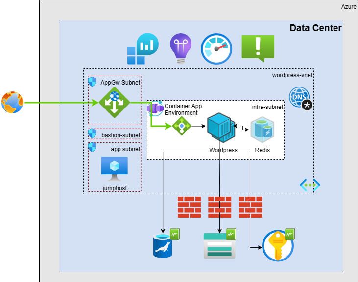
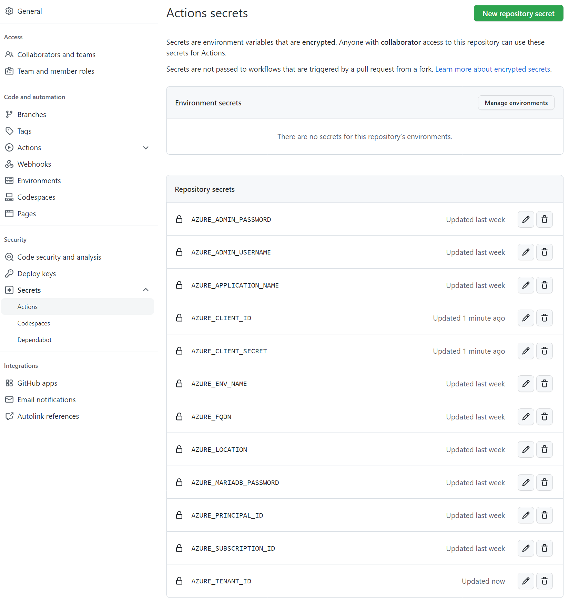

# WordPress appplication template

[](https://github.com/kopantos/app-template-wordpress/actions/workflows/azure-dev.yml)

App Templates are packaged app samples designed to reduce the time it takes a developer to deploy their code to Azure. Unlike standalone example code, the goal of App Templates is to provide all the components to deploy an app to Azure with automation via GitHub Actions or other CI/CD services. 

This specific sample consists of example code, CI/CD components, and documentation containing all the required steps to deploy **a fully functional worspress site** and is designed to be compatible with the [Azure Developer CLI(azd)](https://github.com/Azure/azure-dev/) which is currently in preview.

The purpose of App Templates is to deliver and prove the value of accelerated onboarding for developers who are new to Azure.
## Overview 

WordPress (WP or WordPress.org) is a free and open-source content management system (CMS) written in PHP and paired with a MySQL or MariaDB database. Features include a plugin architecture and a template system, referred to within WordPress as "Themes". WordPress was originally created as a blog-publishing system but has evolved to support other web content types including more traditional mailing lists and Internet fora, media galleries, membership sites, learning management systems (LMS) and online stores. One of the most popular content management system solutions in use, WordPress is used by 42.8% of the top 10 million websites as of October 2021.

To function, WordPress at minimum has to be installed on a web server and connect to a mySQL database. So, to deploy Wordpress in Azure a number of different Azure services can be used: [AKS](../mysql/flexible-server/tutorial-deploy-wordpress-on-aks.md), [Virtual Machines](../virtual-machines/linux/tutorial-lamp-stack.md#install-wordpress), and App Service. For a full list of WordPress options on Azure, see [WordPress on Azure Marketplace](https://azuremarketplace.microsoft.com/marketplace/apps?search=wordpress&page=1).

In this application template, you'll learn how to and will be able to easily, quickly create and deploy your first scalable and secure [WordPress](https://www.wordpress.org/) site to Azure, leveraging [Azure Container Apps](https://learn.microsoft.com/en-us/azure/container-apps/overview) with [Azure Database for MariaDb](https://learn.microsoft.com/en-us/azure/mariadb/overview). This app template uses a number of Azure resources, and incurs a cost for your Azure Subscription. For pricing, visit [Azure pricing calculator](https://azure.microsoft.com/en-us/pricing/calculator/). 

## Architecture


## Tech stack:

- Azure
- Azure-database-for-mariadb
- Container Apps / Managed Environments
- Azure Storage
- Azure Key Vault
- Azure Application Gateway
- Azure Networking
- Github Actions
- App Insights
- Log Analytics
- Bicep

## Prerequisites
- Local shell with Azure CLI installed or [Azure Cloud Shell](https://ms.portal.azure.com/#cloudshell/)
- [Azure Developer CLI (azd)](https://github.com/Azure/azure-dev/)
- Azure Subscription, on which you are able to create resources and assign permissions
  - View your subscription using ```az account show``` 
  - If you don't have an account, you can [create one for free](https://azure.microsoft.com/free).  
## Deployment
You can deploy this app template either using the Azure Developer CLI (azd) or the github pipeline provided.

### Using Azure Developer CLI (azd)

1. Clone this repository localy
1. Login to azure from your terminal. You can do this by running the following command:

    ```
    az login
    ```
1. Verify that you are logged in by running the following command:

    ```
    az account show
    ```
    take a note of the subscription id as you will need it later.
1. Create a folder named ```.azure``` in the root of the project
1. Create a folder in the ```.azure``` folder for the environment you want to deploy to. For example, ```dev``` or ```prod```
1. Create a text file named ```.env``` in the environment folder you created in the previous step and inculde the following environment variables required for the deployment.

    ```
    AZD_PIPELINE_PROVIDER="github"
    AZURE_ADMIN_PASSWORD="<THE JUMPHOST PASSWORD>"
    AZURE_ADMIN_USERNAME="<THE JUMPHOST USERNAME>"
    AZURE_APPLICATION_NAME="<AN APPLICATION NAME>"
    AZURE_ENV_NAME="prod"
    AZURE_FQDN="<THE FQDN OF THE SITE>"
    AZURE_LOCATION="<AN AZURE DC REGION>"
    AZURE_MARIADB_PASSWORD="<THE MARIADB PASSWORD>"
    AZURE_PRINCIPAL_ID=""
    AZURE_SUBSCRIPTION_ID="<YOUR AZURE SUBSCRIPTION ID>"
    resourceGroupName="<THE RESOURCE GROUP NAME>"
    ```

    > **Note:** The ```AZURE_PRINCIPAL_ID``` is the service principal id that will be used for the deployment. Since in this deployment method your user account is used you can leave this blank.

1. Run ```azd provision``` to deploy the app template

### Using Github Actions
1. Fork the repository

    Fork the repository by clicking the 'Fork' button on the top right of the page.
    This creates a copy of the repository in your Github account for you to work in. 


2. Create an Azure Service Principal
    
    The newly created GitHub repo uses GitHub Actions to deploy Azure resources and application code automatically. Your subscription is accessed using an Azure Service Principal. This is an identity created for use by applications, hosted services, and automated tools to access Azure resources. The following steps show how to [set up GitHub Actions to deploy Azure applications](https://github.com/Azure/actions-workflow-samples/blob/master/assets/create-secrets-for-GitHub-workflows.md)

    Create an [Azure Service Principal](https://docs.microsoft.com/en-us/cli/azure/create-an-azure-service-principal-azure-cli) with **contributor** permissions on the subscription. The subscription-level permission is needed because the deployment includes creation of the resource group itself.
    * Run the following [az cli](https://docs.microsoft.com/en-us/cli/azure/?view=azure-cli-latest) command, either locally on your command line or on the Cloud Shell. 
    Replace {app-name} {subscription-id} with the id of the subscription in GUID format.
        ```bash  
        az ad sp create-for-rbac --name {app-name} --role contributor --scopes /subscriptions/{subscription-id}/resourceGroups/rg-ContosoUniversityDemo --sdk-auth     
        ```
    * The command should output a JSON object similar to this:
        ```json
        {
            "clientId": "<GUID>",
            "clientSecret": "<GUID>",
            "subscriptionId": "<GUID>",
            "tenantId": "<GUID>",
            "activeDirectoryEndpointUrl": "<URL>",
            "resourceManagerEndpointUrl": "<URL>",
            "activeDirectoryGraphResourceId": "<URL>",
            "sqlManagementEndpointUrl": "<URL>",
            "galleryEndpointUrl": "<URL>",
            "managementEndpointUrl": "<URL>"
        }```

    copy this information as it will be used in the next step.

3. Store the output JSON as the value of a GitHub Actions secret named 'AZURE_CREDENTIALS'
    + Under your repository name, click Settings. 
    + In the "Security" section of the sidebar, select Secrets. 
    + At the top of the page, click New repository secret
    + Provide the secret name as AZURE_CREDENTIALS
    + Add the output JSON as secret value
   
4. Provide the rest of the secrets
    
    You will need to provide the following values as repository secrets to be used by the GitHub Actions workflow.
    

> **Note:** The ```AZURE_PRINCIPAL_ID``` is the clientId field of the service principal that was created in the previous step.

5. Execute the azure-dev.yml action workflow

    + Under your repository name, click Actions .
    + In the left sidebar, click the workflow "azure-dev.yml".
    + Above the list of workflow runs, select Run workflow .
    + Use the Branch dropdown to select the workflow's main branch, Click Run workflow .

After deployment, below resources will be created


## Getting Started with Wordpress
Since this is a brand new Wordpress site, you will need to complete the initial setup which creates the Database schema and populates it with seed data as well as creates the ```wp-config.php``` file to read the configuration from the environment variables.

To do this, you will first need to **map the FQDN of the site you specified when provisioning the template to the public IP address of the Azure Application Gateway**. You can do this by either adding an entry to your pubcic dns zone or simply by adding an entry to your hosts file.

Once you have mapped the FQDN to the public IP address, you can navigate to the site in your browser and complete the initial setup.
### New WordPress instance
1. Navigate to the http://FQDN/wp-admin/setup-config.php using your browser

    > **Note:** Don't worry if the stylesheet is broken, that's because the siteurl and home variables haven't been configured yet.

1. Fill in the database name with the value ```wordpress```, db user, db password, and db host and click Run the install

    

1. Fill in the site title, the administrator username, password, and email address and click Install WordPress

    

1. Now that the setup is complete, you will need to change the site name and home configuration entries at the WordPress database. 

    * To do this navigate to the Azure Portal and open a Bash cloud shell session
    * Make sure you are loged in to the correct subscription using tha ```az account show``` command
    * Create a firewall rule to connect to the database

        ```bash
        resourceGroup=<RESOURCE GROUP NAME>
        mariaDBServer=<MARIADB SERVER NAME> #Just the <name> without -prod.mariadb.database.azure.com
        clientIP=$(curl -s checkip.dyndns.org | sed -e 's/.*Current IP Address: //' -e 's/<.*$//')
        az mariadb server firewall-rule create --resource-group $resourceGroup --server $mariaDBServer --name allow-client --start-ip-address $clientIP --end-ip-address $clientIP
        ```
    * Connect to the database using the following command

        ```bash
        username=<DB ADMIN USERNAME>    #db_admin@<name>
        mysql -u $username -p -h <MARIADB SERVER NAME>-prod.mariadb.database.azure.com wordpress
        ```
    * Once connected, run the following commands to update the siteurl and home configuration entries

        ```sql
        use wordpress;
        update wp_options set option_value = 'http://FQDN' where option_name = 'siteurl';
        update wp_options set option_value = 'http://FQDN' where option_name = 'home';
        ```

1. Now you can navigate to the site in your browser and login using the username and password you specified during the setup.

### Migrate an existing WordPress instance
To migrate an existing WordPress instance, you will need to perform two tasks. First export the database from the existing site and import it into the new site and then copy the site files to the new site.

To do this navigate to the Azure Portal and open a Bash cloud shell session. Make sure you are loged in to the correct subscription using tha ```az account show``` command

1. Create a firewall rule to connect to the database

    ```bash
    resourceGroup=<RESOURCE GROUP NAME>
    mariaDBServer=<MARIADB SERVER NAME> #<name> with out the domain name
    clientIP=$(curl -s checkip.dyndns.org | sed -e 's/.*Current IP Address: //' -e 's/<.*$//')
    az mariadb server firewall-rule create --resource-group $resourceGroup --server $mariaDBServer --name allow-client --start-ip-address $clientIP --end-ip-address $clientIP
    ```

1. Connect to the database using the following command

    ```bash
    username=<DB ADMIN USERNAME>    #db_admin@<name>
    mysql -u $username -p -h $mariaDBServer
    ```
1. Once connected, restore your existing wordpress database

    ```sql
    mysql -u $username -p -h <MARIADB SERVER NAME>-prod.mariadb.database.azure.com wordpress < <PATH TO YOUR BACKUP FILE>
    ```
1. Make sure the siteurl and home configuration entries are pointing to the new site
    ```sql
    use wordpress;
    update wp_options set option_value = 'http://FQDN' where option_name = 'siteurl';
    update wp_options set option_value = 'http://FQDN' where option_name = 'home';
    ```
1. Create a firewall rule to connect to the Azure storage account
    ```bash
    resourceGroup=<RESOURCE GROUP NAME>
    storageAccount=<STORAGE ACCOUNT NAME>
    clientIP=<YOUR IP>
    az storage account firewall-rule create --resource-group $resourceGroup --account-name $storageAccount --name allow-client --start-ip $clientIP --end-ip $clientIP

    azcopy login --tenant-id <TENANT ID>
    azcopy copy 'myDirectory\*' 'https://$storageAccount.file.core.windows.net/fileshare' --recursive
    ```

1. Map the FQDN of your site to the public IP address of the Azure Application Gateway. You can do this by adding an entry to your hosts file so that only you can access the new WordPress instance.

> **Note:** This is a basic migration guide. As WordPress sites often contain various customizations you might need to refer to the [WordPress documentation](https://wordpress.org/support/article/moving-wordpress/) for more information on migrating WordPress sites.

## Clean up resources
When you are done, you can delete all the Azure resources created with this template by running the following command:

```bash
resourceGroup=<RESOURCE GROUP NAME>
az group delete --name $resourceGroup
```

or if you deployed using the azd cli

```
azd down
```
## Contributing

This project welcomes contributions and suggestions.  Most contributions require you to agree to a
Contributor License Agreement (CLA) declaring that you have the right to, and actually do, grant us
the rights to use your contribution. For details, visit https://cla.opensource.microsoft.com.

When you submit a pull request, a CLA bot will automatically determine whether you need to provide
a CLA and decorate the PR appropriately (e.g., status check, comment). Simply follow the instructions
provided by the bot. You will only need to do this once across all repos using our CLA.

This project has adopted the [Microsoft Open Source Code of Conduct](https://opensource.microsoft.com/codeofconduct/).
For more information see the [Code of Conduct FAQ](https://opensource.microsoft.com/codeofconduct/faq/) or
contact [opencode@microsoft.com](mailto:opencode@microsoft.com) with any additional questions or comments.

## Trademarks

This project may contain trademarks or logos for projects, products, or services. Authorized use of Microsoft 
trademarks or logos is subject to and must follow 
[Microsoft's Trademark & Brand Guidelines](https://www.microsoft.com/en-us/legal/intellectualproperty/trademarks/usage/general).
Use of Microsoft trademarks or logos in modified versions of this project must not cause confusion or imply Microsoft sponsorship.
Any use of third-party trademarks or logos are subject to those third-party's policies.
